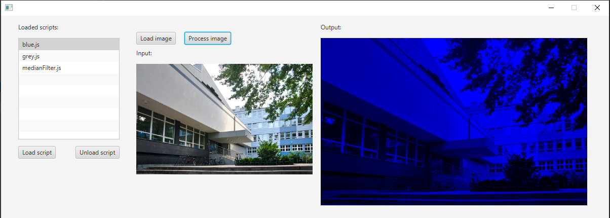
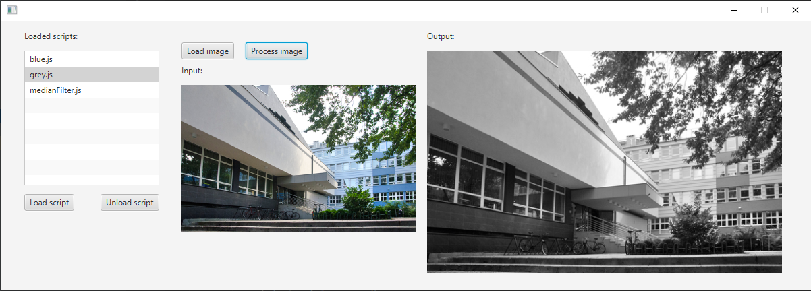
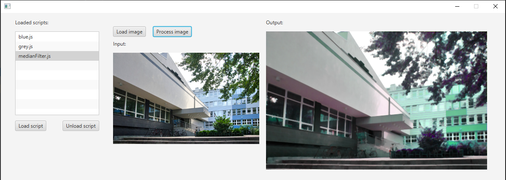

## Efekty działania filtrów:

- Niebieski filtr:
  
  
  
- Filtr monochromatyczny:

  

- Filtr medianowy:

  

## Instrukcja użytkowania:

- Wybór obrazu nastepuje po naciśnięciu przycisku "Load image". 
- Ładowanie skryptu następuje po naciśnięciu przycisku "Load script".
- Skrypt można wyładować wybierając go z listy i wciskając przycisk "Unload script".
- Przetwarzanie obrazek odbywa się po wybraniu skryptu i naciśnięciu przycisku "Process image".

