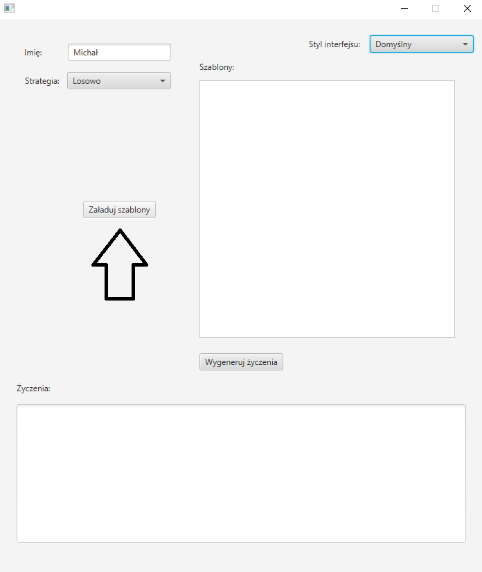
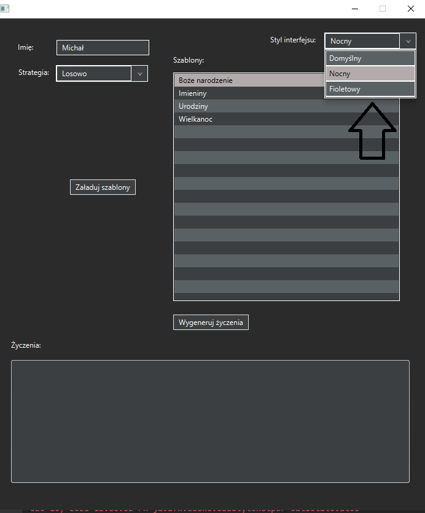
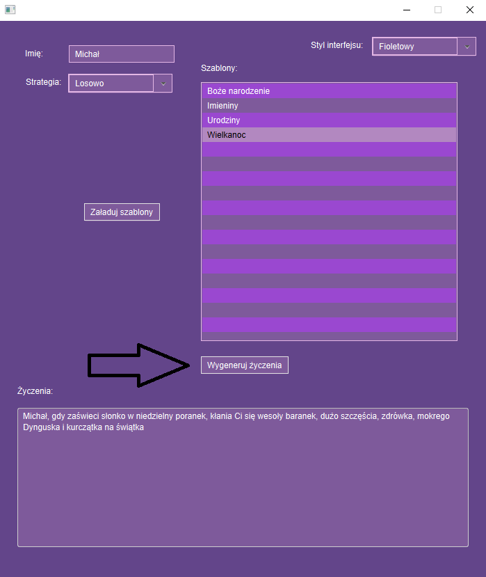

## Uruchomienie aplikacji

```java
java -jar ./wish-app-javafx-1.0-SNAPSHOT-jar-with-dependencies.jar
```

## Opis aplikacji

Po jej uruchomieniu należy wybrać foldery zawierajcy szablony. 



Szablony mają znajdować się w osobnych folderach, każdy folder związany jest z osobną okolicznością. 



W prawym górnym rogu można zmieniać style graficznego interfejsu użytkownika (na zrzutach ekranu przedstawiono dostępne style).



Po wprowadzeniu imienia i wybrania okazji można wygenerować życzenia za pomocą przycisku "Wygeneruj życzenia".

Aplikacja posiada różne strategie generowania życzeń:

- losowo,
- kolejno (od najkrótszego do najdłuższego),
- najdłuższe,
- najkrótsze.